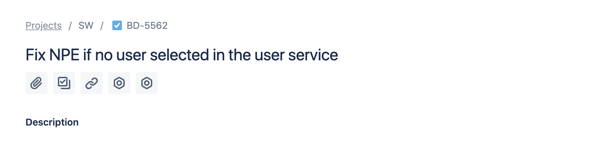

# gitlink

Auto link to reference external resources based on the reference ID in the commit message.

## Usage

You should have two variables set:

* `REFERENCE_PATTERN` - Pattern used in commit message. For example, to link issues like "PS-1425", you should set the variable to `PS-\d\d\d\d`
* `TARGET_URL` - Link to the external system you want to link to. For example, if you're using Jira, it should be set to "https://proteantecs.atlassian.net/browse"

Once set, you simply run:

```bash
gitlink <SHA>
```

which will open the browser with the issue referenced in the commit message.

For example, having the following log:


```
Author: MarounMaroun <****.com>
Date:   Tue Jun 30 23:16:30 2020 +0300

    BD-5562: handle missing user in the user service
```

When you run:

```bash
gitlink 7d21af686732bd1812f79c4c51ac98a903de5c3d
```

A new tab with the relevant issue will be opened:



## Contributing

Pull requests are welcome. For major changes, please open an issue first to discuss what you would like to change.

## License ⚖️
[MIT](https://choosealicense.com/licenses/mit/)
